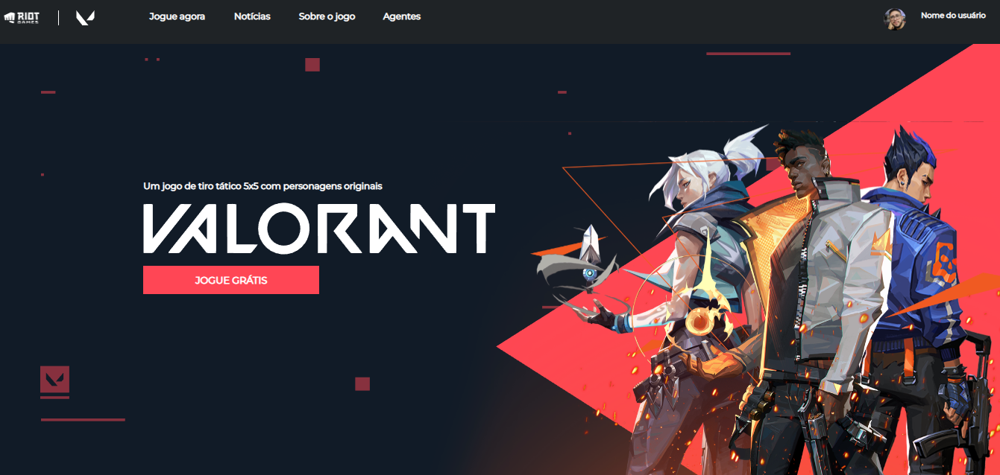
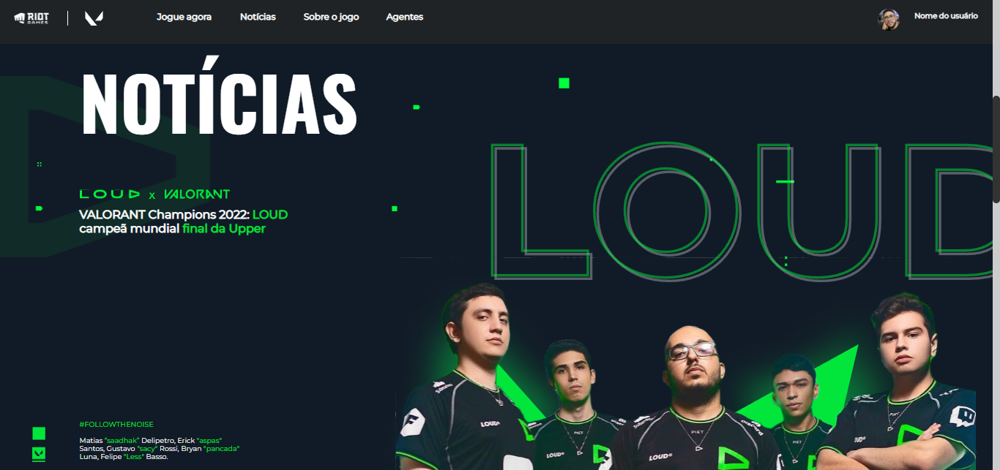
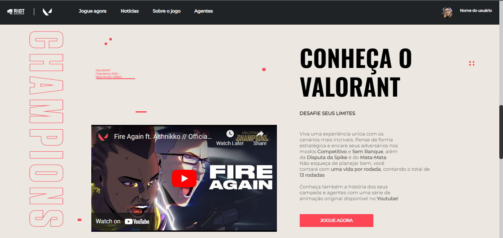

## [LEAD MENTORING] - Valorant Project
Esse projeto foi proposto pelo nosso mentor da Dell Lead Mentoring, Christian Castro, e tem como objetivo a criação de uma landing page baseada no jogo Valorant da Riot Games.

## Tecnologias 

Aqui as tecnologias usadas nesse projeto:

* HTML5
* CSS3
* NunJucks

## Páginas  

### 1 - Home

### 2 - Notícias

### 3 - Agentes

### 4 - Sobre o jogo

## Links
  - Repository: https://github.com/jonathasltavares/-Lead-Mentoring--Valorant-Project  
  - Deploy: https://valorantprojectleadmentoring.herokuapp.com

  ## Authors

  <a href="github.com/jonathasltavares">Jonathas Luan</a>  
  <a href="https://github.com/IsabeleOliveira">Isabele Oliveira</a>  
  <a href="https://github.com/CCastro01">Christian Castro</a>  
